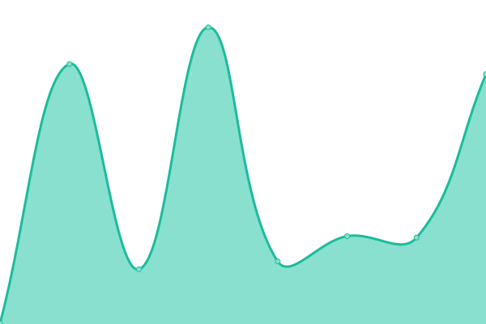
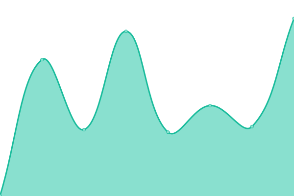
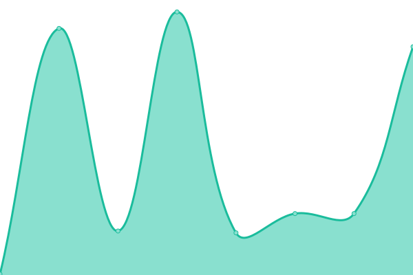

# [📈 Live Status](https://demo.upptime.js.org): <!--live status--> **🟩 All systems operational**

This repository contains the open-source uptime monitor and status page for [Bridgewater State University](https://www.bridgew.edu), powered by [Upptime](https://github.com/upptime/upptime).

With [Upptime](https://upptime.js.org), you can get your own unlimited and free uptime monitor and status page, powered entirely by a GitHub repository. We use [Issues](https://github.com/Bridgewater-State-University/upptime/issues) as incident reports, [Actions](https://github.com/Bridgewater-State-University/upptime/actions) as uptime monitors, and [Pages](https://demo.upptime.js.org) for the status page.

<!--start: status pages-->
<!-- This summary is generated by Upptime (https://github.com/upptime/upptime) -->
<!-- Do not edit this manually, your changes will be overwritten -->
<!-- prettier-ignore -->
| URL | Status | History | Response Time | Uptime |
| --- | ------ | ------- | ------------- | ------ |
|  [BSU Public Website](https://www.bridgew.edu) | 🟩 Up | [bsu-public-website.yml](https://github.com/Bridgewater-State-University/upptime/commits/HEAD/history/bsu-public-website.yml) | 

 268ms
     
 | 

<a href="https://bridgewater-state-university.github.io/upptime/history/bsu-public-website">100.00%</a>
    

|  [Institutional Catalog](https://catalog.bridgew.edu) | 🟩 Up | [institutional-catalog.yml](https://github.com/Bridgewater-State-University/upptime/commits/HEAD/history/institutional-catalog.yml) | 

 438ms
     
 | 

<a href="https://bridgewater-state-university.github.io/upptime/history/institutional-catalog">100.00%</a>
    

|  [Student Portal](https://mybsu.bridgew.edu) | 🟩 Up | [student-portal.yml](https://github.com/Bridgewater-State-University/upptime/commits/HEAD/history/student-portal.yml) | 

 174ms
     
 | 

<a href="https://bridgewater-state-university.github.io/upptime/history/student-portal">100.00%</a>
    

<!--end: status pages-->

[**Visit our status website →**](https://bridgewater-state-university.github.io/upptime/)

## 📄 License

- Powered by: [Upptime](https://github.com/upptime/upptime)
- Code: [MIT](./LICENSE) © [Bridgewater State University](https://www.bridgew.edu)
- Data in the `./history` directory: [Open Database License](https://opendatacommons.org/licenses/odbl/1-0/)
